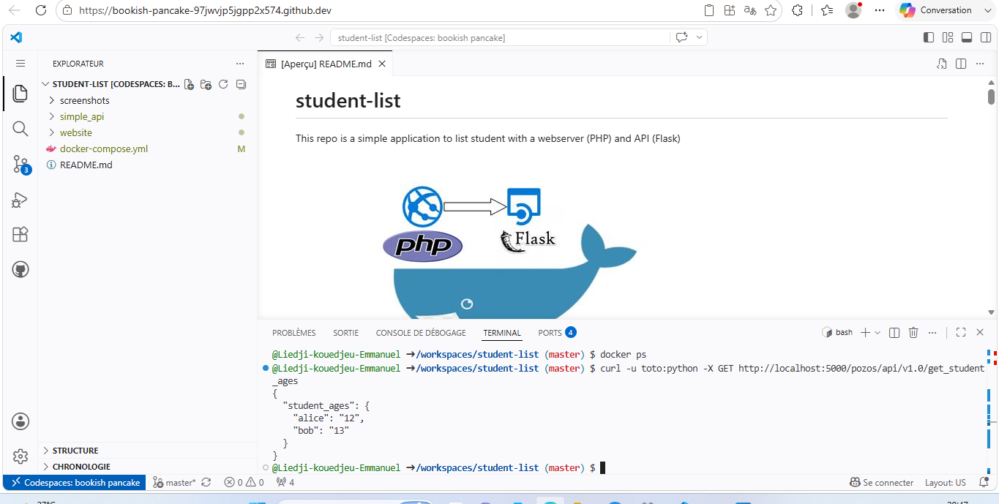
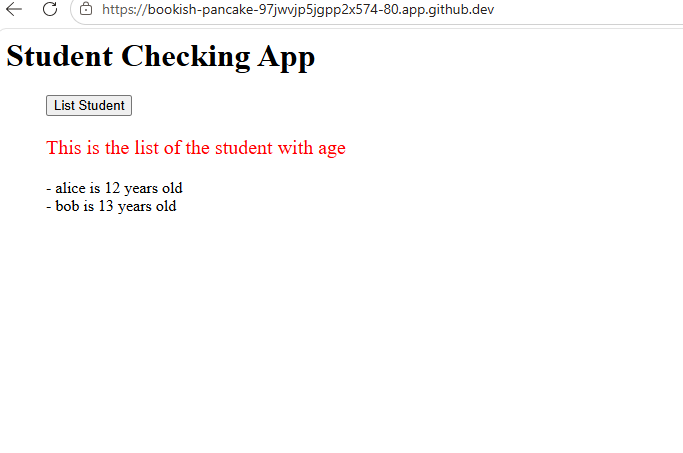
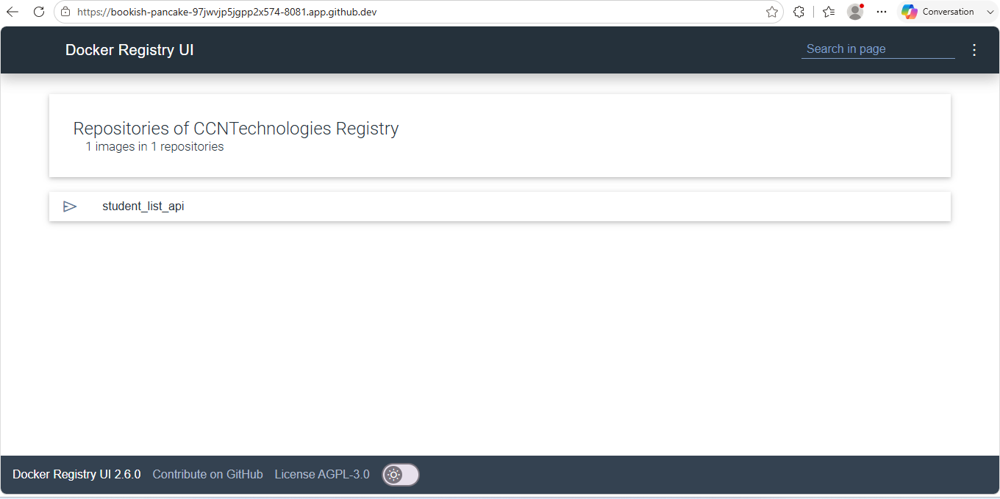

# Mini Projet Docker - Student List
## Auteur : Liedji-kouedjeu-Emmanuel

## Description
Ce projet est une application simple qui permet de lister des étudiants avec leur âge. Elle est composee de deux modules :
- **API REST** : ecrite en Python (Flask), elle fournit la liste des etudiants au format JSON
- **Application Web** : ecrite en PHP, elle permet a utilisateur d afficher la liste des etudiants

## Architecture
L application utilise Docker pour conteneuriser les deux modules et les faire communiquer via un reseau Docker dedie.

## Fichiers du projet
- simple_api/Dockerfile : fichier pour construire l image de l API
- docker-compose.yml : fichier pour deployer les deux services
- simple_api/student_age.py : code source de l API
- simple_api/student_age.json : donnees des etudiants
- simple_api/requirements.txt : dependances Python
- website/index.php : page web PHP

## Construction et test de l API

### Construction de l image
L image de l API a ete construite avec la commande :

docker build -t student_list_api:v1 .

### Test de l API avec curl

curl -u toto:python -X GET http://localhost:5000/pozos/api/v1.0/get_student_ages

## Deploiement avec Docker Compose

L application complete a ete deployee avec :

docker-compose up -d

Le site web est accessible sur le port 80 et affiche la liste des etudiants.

## Registre Docker prive

Un registre Docker prive a ete deploye pour stocker les images. L image a ete poussee avec :

docker tag student_list_api:v1 localhost:5001/student_list_api:v1
docker push localhost:5001/student_list_api:v1

